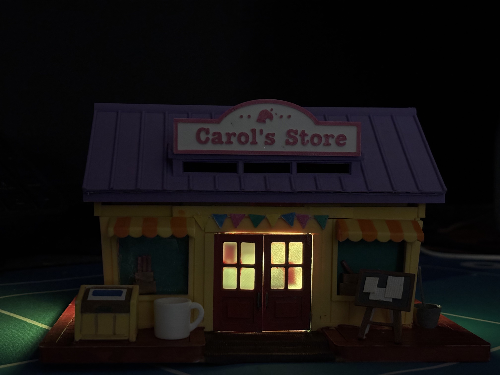

# Real-life Animal Crossing: Nook's Cranny Shop
**用ESP32+3D打印将动森商店搬进现实**  
[](https://opensource.org/licenses/MIT)

 

## 🌟 项目亮点
```diff
+ 沉浸式动森体验   - 招牌LED同步游戏昼夜灯光
+ 低成本可复刻     - 总成本<¥200（含3D打印）
```

## 📦 硬件清单

主控板	ESP32-S2
LED灯带	WS2812B
传感器	电容触摸模块

## 🤝 参与贡献
欢迎提交PR！推荐方向：
SDK开发
添加Amibo刷卡功能

This project is not affiliated with Nintendo. Animal Crossing is a trademark of Nintendo.